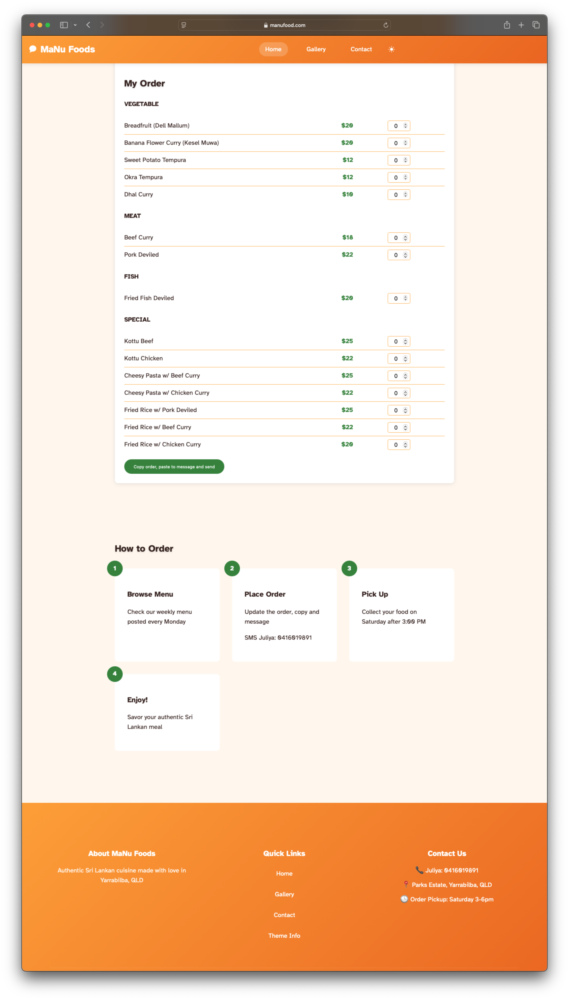
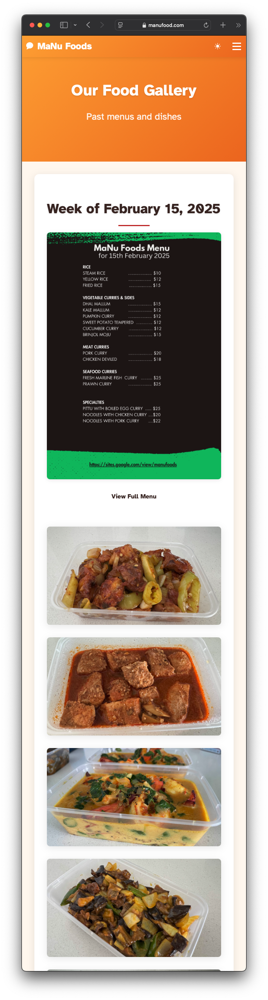
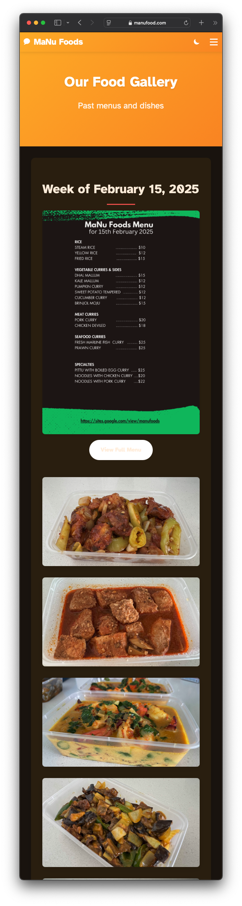

---
title: 'Static website development project using 11ty and Copilot '
description: "static website development project using 11ty and Copilot free hosting quick and easy no maintainance, deployed using github actions to github pages"
date: 2025-02-20
--- 

<!-- # First static website development project using 11ty and Copilot  -->

The most effective way to develop software is build something visible. The best and easiest useful tech product is building a static website. I am not very fond of using the popular tools like wordpress, drupal, joomla for static website development as its overkill for a static website. They require a database to be running and requires more maintainance, also costs more than nessasary to maintain a static website. 

I have been instested about static site generated like Jekyll and 11ty. However my UI design skills are not the best to build a good looking website. I am generally alright at making the workflows and functionality good.  I sough help from GitHub Copilot and came up with my first website using 11ty hosted free on Github pages. The code is hosted publicly on github, code changes are built and deployed to github pages using github actions.  

This is my first experience with 11ty from scratch and Github copilot to collaboratively implement something. 

The final product is a website for a home cooked food preperation small business. I was able to start and finish the website overnight in about 4 hours. 
I started by asking copilot to provide a navigation bar that is responsive. Then created a home page with hero elements and content sections. Next suggested a theme to use with dark mode and light mode. Added footer and finally additional pages. 

The final product looks like this which I am happy with and the customer is happy with. 
[MaNu Food website](https://manufood.com)

Home page top

Home page continued

Gallery 

Gallery dark mode
