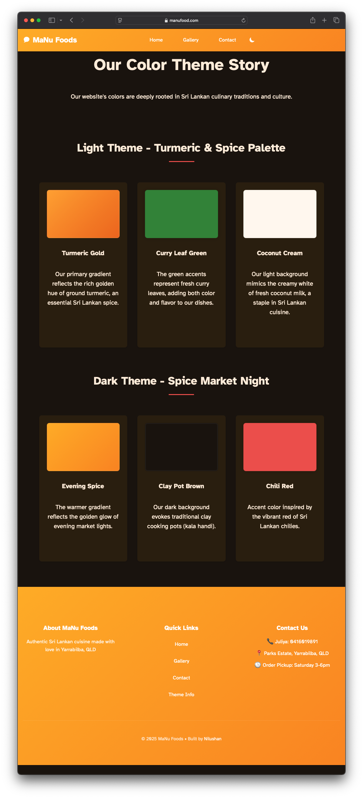

---
title: 'Static website development project using 11ty and Copilot '
description: "static website development project using 11ty and Copilot. Free hosting on Github pages. Deployed using github actions"
date: 2025-02-20
--- 

<!-- # First static website development project using 11ty and Copilot  -->

The most effective way to develop software is build something visible. The best and easiest useful tech product is building a static website. I am not very fond of using the popular tools like Wordpress, Drupal, Joomla for static website development as its overkill for a static website. They require a database to be running and requires more maintainance, also costs more than nessasary to maintain a static website. 

I have been instested about static site generated like Jekyll and 11ty. However my UI design skills are not the best to build a good looking website. I am generally alright at making the workflows and functionality good.  I sough help from GitHub Copilot and came up with my first website using 11ty. It was hosted free on Github pages. The code is hosted publicly on github, code changes are built and deployed to github pages using github actions.  

This is my first experience with 11ty from scratch and first experience using Github copilot to collaboratively implement something. 

The final product is a website for a home cooked food preperation small business. I completed the website in about 4 hours, working overnight.

I began by prompting Copilot to generate a responsive navigation bar. From there, I built a home page featuring a hero section and various content areas. I requested Copilot to suggested a theme with both dark and light mode options. Finally, I added a footer and supplementary pages.

I'm pleased with the final result, and more importantly, so is the client. You can see the live website here: [MaNu Food website](https://manufood.com)

Here are some screenshots of the website:

**Home Page (Top)**

**Home Page (Continued)**

**Food Gallery**

**Food Gallery (Dark Mode)**

**Color Theme Story**
